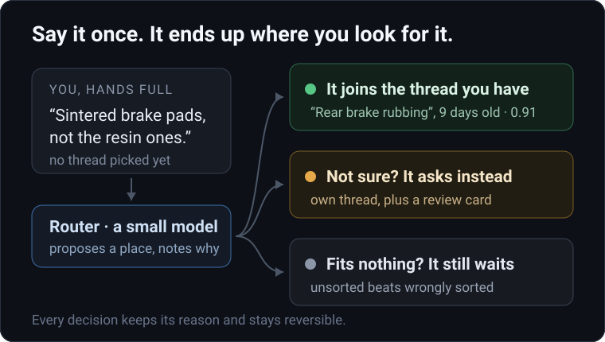
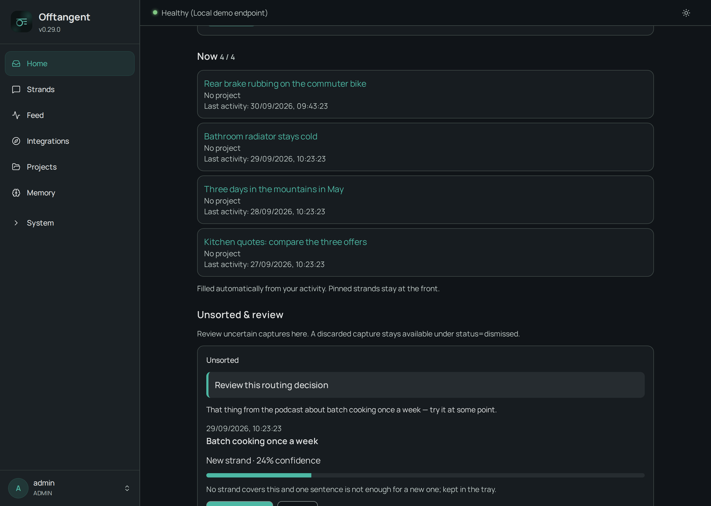
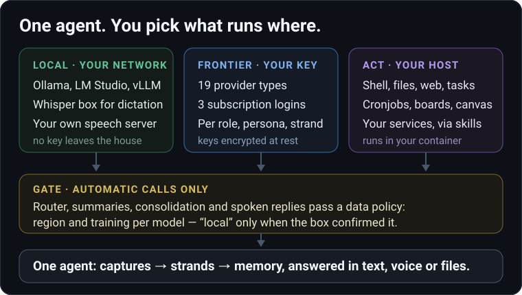
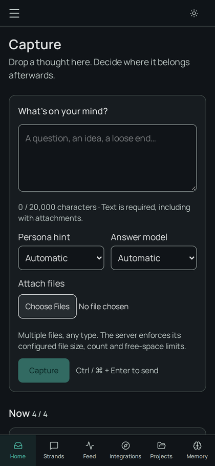

<p align="center">
  <picture>
    <source media="(prefers-color-scheme: dark)" srcset="docs/assets/logo-dark.svg">
    <source media="(prefers-color-scheme: light)" srcset="docs/assets/logo-light.svg">
    
  </picture>
</p>

<h1 align="center">Offtangent</h1>

<p align="center"><strong>Say the thought. The sorting happens afterwards.</strong></p>

<p align="center">
🙏 <strong>Built on <a href="https://github.com/meteyou/axiom">Axiom</a> by <a href="https://github.com/meteyou">meteyou</a>.</strong><br>
A huge thank-you for the foundation that made Offtangent possible.
</p>

---

> Up a ladder, both hands busy with a paint roller.
> Out of nowhere you remember the brake pads have to be the **sintered** ones, not the resin ones.
>
> Opening a chat app now means finding the right conversation with paint on your fingers — so you tell yourself you will remember. **You will not.**
>
> You just say the sentence out loud instead. Nine days later, when you finally get to the bike, it is sitting in that thread, in context, with the rest of the diagnosis.

<p align="center">
  <picture>
    <source media="(max-width: 560px)" srcset="docs/assets/offtangent-flow-mobile.svg">
    
  </picture>
</p>

**Offtangent is a self-hosted agent backend for people whose thoughts arrive out of order.** Every input is a *capture*, accepted without a destination. A small *router* model proposes where it belongs, shows its reason, and one tap undoes it.

<p align="center">
🗣️ <strong>Speak first</strong> &nbsp;·&nbsp; 🧭 <strong>Filed with a visible reason</strong> &nbsp;·&nbsp; ↩️ <strong>Wrong? One tap</strong> &nbsp;·&nbsp; 🗄️ <strong>Your server, your data</strong>
</p>

---

## 👀 Ten seconds of the real thing

<picture>
  <source media="(prefers-color-scheme: dark)" srcset="docs/assets/offtangent-router-dark.png">
  <source media="(prefers-color-scheme: light)" srcset="docs/assets/offtangent-router-light.png">
  
</picture>

<sub><b>Screenshot of the running web UI</b> — throwaway instance, invented content. <b>Top:</b> the <i>Now set</i>, the handful of threads that are live right now. <b>Bottom:</b> the <i>tray</i>, captures the router was unsure about — each with its proposed target, a confidence number and one sentence of reasoning.</sub>

---

## 🎯 Three thoughts, three outcomes

**🟢 &nbsp;“The pads have to be sintered.”**
Matches an open thread about that rubbing brake → filed there, silently. You find it when you open the thread.

**🟡 &nbsp;“Maybe the thermostatic head is just stuck.”**
Could be the radiator thread, could be a new job — the router is not sure enough → it opens its own thread and puts a review card in the tray. One tap merges it.

**⚪ &nbsp;“That batch-cooking thing from the podcast.”**
Fits nothing you are doing → it stays in the tray, unsorted, with the router's own admission why. **Unsorted beats wrongly sorted.**

> **The asymmetry is deliberate:** a wrong new thread costs you one merge. A wrong append buries a thought inside an unrelated conversation, where you will never look again.

---

## 🧠 One agent, several engines

<p align="center">
  <picture>
    <source media="(max-width: 560px)" srcset="docs/assets/offtangent-stack-mobile.svg">
    
  </picture>
</p>

Offtangent ships **no model**. It ships the wiring: which endpoint answers, which one may be picked *for* you, and what the agent is allowed to do on your machine.

- 🏠 **Local** — `ollama` (browse, pull and enable models from the UI) or `openai-compatible` for LM Studio, vLLM, NIM. Dictation can go to your own Whisper server (`whisper-url`: a raw URL, no provider entry, no key), the spoken reply to your own OpenAI-compatible `/v1/audio/speech` box.
- ☁️ **Frontier** — 19 provider types in total: 16 API-key types (two of them the local ones above), plus 3 OAuth subscription logins (Claude Pro/Max, ChatGPT Codex, GitHub Copilot) where you pay a flat fee and the instance shows the remaining quota. Keys are encrypted at rest with your `ENCRYPTION_KEY`; for key-based types the base URL is pinned by the preset, so a typo cannot redirect your key.
- 🎚️ **Per job, not per app** — router, project assignment, fact extraction, session summaries, memory consolidation, transcript cleanup, spoken summaries and every kind of background task each take their own model; a persona or a single strand can pin one. Nothing rotates by itself — each role is one line in `settings.json`.
- 🧰 **Act** — shell, files, web fetch, web search (DuckDuckGo out of the box, your own SearXNG if you have one), background tasks, cronjobs, boards, canvas views and file delivery run in *your* container, on *your* network.

### Three shapes that actually run

**🎙️ Dictate now, sort later — audio path stays on your box.** Voice note in the app or Telegram → transcription on your own Whisper endpoint → optional cleanup of the raw transcript by a small model (`modelPolicy.roles.sttRewrite`) → the router (its chain can end on a 14B-class local entry) files it or leaves it in the tray. A frontier model is only involved once you open that strand and ask it something.

**🗣️ Frontier brain, your voice.** You ask inside a strand; the active model runs the tool loop against your host; the answer comes back as a voice message through whichever TTS you configured — hosted, or a speech server on your own network. Two different engines in one turn, both picked by you.

**📬 Private data read by a local model.** A connector (mailbox, calendar) hands its raw data to a sub-agent that is pinned to a **strictly local** model and fails closed when none is configured — the frontier model in your chat only ever sees the short answer.

> **What self-hosting buys, precisely:** the server, the database, the memory files, the provider keys and every tool call are yours, and you choose per role which endpoint sees what. Pick a cloud endpoint and that turn's text goes to that cloud — *self-hosted is not "all inference is local"*. The difference is that the choice, the gate and the audit trail are on your side. A fully local instance is possible (local LLM + Whisper + your own speech server); what it costs is throughput and tool-calling reliability.

**The automatic calls have a gate.** Every provider and model carries `region` (`local` / `eu` / `us` / `cn`) and `training` (`no` / `yes` / `unknown`). For an Ollama model `local` is *verified*, not assumed: the backend asks that box for its own model list and accepts `local` only when the model is listed without a `remote_host` and the answer is younger than 30 minutes. Modes are `off`, `audit` (default) and `enforce`; a `cn` region and the model families in `privacy.blockedModelFamilies` (default `glm`, `kimi`) are never an automatic choice, not even on your own hardware. Your own explicit pick is always honoured and written to the audit list.

<details>
<summary><b>What ships, what you configure, what needs an external account</b></summary>

<br>

| Capability | Built in | You set it up | Needs an external API |
| --- | --- | --- | --- |
| Talking model | 19 provider types (16 API-key, 3 OAuth subscription), bundled model catalog, runtime switching, per-strand pins | which provider/model | yes, unless the endpoint is your own |
| Local LLMs | `ollama` + `openai-compatible` types, 1 h request timeout, 60 s health check, optional slim prompt profile | the box and the weights | no |
| Helper roles | `modelPolicy.roles` incl. router chains with confidence hand-over, admin API with step-by-step resolution | one line per role | no |
| Speech-to-text | `whisper-url`, `ollama`, OpenAI, Deepgram; artefact filter for subtitle/music noise; optional `transcribe_audio` tool | the endpoint or key | only for OpenAI / Deepgram |
| Text-to-speech | OpenAI-compatible `/v1/audio/speech` (hosted **or** self-hosted, incl. streaming and `sample_rate`), Mistral, Deepgram, Gemini; speaker button, Telegram voice replies, `send_voice_message` tool + voice skill | the endpoint or key | only for the hosted ones |
| Data policy gate | region/training per model, verified-local check, `audit`/`enforce`, blocked model families, audit list | the two fields per provider | no |
| Tools on your host | shell, read/write/edit/list files, web fetch, web search, tasks, cronjobs, reminders, boards, canvas, file delivery, memory + fact search | nothing | only paid search backends (Brave/Tavily) |
| Connectors | OAuth/API-key store on the instance, `local_only` data class, sub-agent pinned to a strictly local model | the OAuth client + one local model | the service you connect |
| Skills | loader for user, agent-created and 5 bundled skills | your own `SKILL.md` | depends on the skill |
| **Image generation** | **nothing — no image model, no image provider, no image tool** | your own service called from a skill via `shell`/HTTP; delivery through `send_file_to_user` / `canvas_write` is built in | whatever you point that skill at |

Details: [Models & providers](docs/guide/models.md) · [Built-in tools](docs/concepts/tools.md) · [Speech-to-text](docs/settings/speech-to-text.md) · [Text-to-speech](docs/settings/text-to-speech.md) · [Connectors](docs/concepts/connectors.md) · [Skills](docs/concepts/skills.md)

</details>

---

## 🆚 Why not just a chat app

| Linear chat | Offtangent |
| --- | --- |
| You pick the conversation, **then** type. | You speak. Placement is proposed afterwards. |
| Threads are folders you maintain. | Threads rank themselves from your activity. |
| The model is confident or silent. | Confidence is a number on screen, with the reason next to it. |
| Wrong guesses vanish into history. | Every decision keeps its reason and stays reversible. |
| One endless scrollback. | Several threads live at once; old turns compress into digests you can reload. |
| Your data sits on someone's platform. | You run the server. Provider keys are encrypted at rest. |

---

## 🧰 What it does today

Verified against the code in this repository — not a roadmap.

- **One write path.** `POST /api/captures`, idempotent per client key: a retry after a dropped connection returns the original decision, not a duplicate thought.
- **The router is its own role.** A small, cheap model routes, extracts facts and summarises; a larger one does the actual talking. Which model answered, and how long it took, is recorded on every decision.
- **Note or ask.** A thought you only want recorded is filed in silence. A question starts a turn. In between, you get one confirmation card instead of an unwanted essay.
- **Dictation without the artefacts.** Speech-to-text noise like `* Music *` or subtitle credits is caught before the router ever sees it.
- **Threads that carry work.** Tags, projects, pinning, archiving, unread state, fork-with-handoff, per-thread token telemetry.
- **Memory with provenance.** Markdown files (SOUL, MEMORY, daily notes, wiki) plus a fact store; every fact knows where it came from.
- **Background tasks, cronjobs, boards.** Work handed to an isolated agent with its own model, budget and slice of context; long-lived result surfaces instead of one chat message per run.
- **Interfaces.** Web UI (Nuxt 4), Telegram bridge, documented REST/WebSocket API.

<p align="center">
  
</p>

<p align="center"><sub><b>Same instance on a 390 px phone viewport.</b> One box. No folder to choose first.</sub></p>

---

## ⚖️ What it is not

Not a team chat, not a ticket system, not multi-tenant SaaS, not an IDE assistant.

**It ships no model** (see [One agent, several engines](#-one-agent-several-engines)), and it generates no images. The one hard requirement for the talking model: **tool calling.** A model without it will describe what it would do, and nothing happens.

**Status: early.** One person, one instance, daily use. It works, but nobody has yet set it up from the quickstart alone. Breaking changes land without a deprecation period and there is no release versioning yet. Worth trying if you want to run your own instance and report what breaks — not something to depend on yet.

---

## 🚀 Quickstart

```bash
git clone https://github.com/Kruppes/offtangent.git offtangent
cd offtangent
cp .env.example .env
```

Set the required values in `.env`:

```env
ADMIN_PASSWORD=choose-a-strong-password
JWT_SECRET=<openssl rand -hex 32>
ENCRYPTION_KEY=<openssl rand -hex 32>   # encrypts provider keys at rest, back this up
HOST_PORT=3000                          # optional, default 3000
```

```bash
docker compose up -d --build
```

Log in as `admin`, add a provider under **Settings → Providers**, drop your first thought into the capture box.

**Next:** [What it is for](docs/guide/use-cases.md) · [Captures & strands](docs/concepts/captures-and-strands.md) · [Models & providers](docs/guide/models.md) · [Deployment options](docs/guide/deployment.md)

---

<details>
<summary><b>🔍 Under the hood</b> — where things live, how to develop, the vocabulary</summary>

<br>

**Vocabulary.** A **capture** is any input, accepted without a destination. A **strand** is a thread of thought that lives for weeks rather than one session. The **Now set** is the small, automatically ranked set of strands that are currently live (default 4). The **tray** holds captures that were not filed.

**Confidence bands.** Appending to an existing strand needs ≥ 0.70, a review card is created from ≥ 0.40, anything below stays in the tray. Those two bands are named constants in `capture-router.ts` (`CONFIDENCE_HIGH`, `CONFIDENCE_MEDIUM`); what *is* configuration in `settings.json` → `heuristics.*` is the surrounding behaviour — strand window size, tool-output caps, recency.

| Area | Where |
| --- | --- |
| Captures & router | `packages/core/src/capture-router.ts`, `packages/web-backend/src/api/modules/captures/` |
| Strands | `packages/web-backend/src/api/modules/strands/` |
| Personas | `packages/core`, `/data/agents/<id>/` |
| Projects | `packages/web-backend/src/routes/projects.ts` |
| Memory | `packages/core/src/memory*.ts`, `message-digest.ts`, `strand-context.ts` |
| Tasks & delegation | `packages/core/src/task-*.ts`, `delegation-context.ts` |
| Auth | `packages/web-backend/src/routes/auth.ts` |
| Interfaces | `packages/web-frontend` (Nuxt 4, Vue 3), `packages/telegram` |

**Development.** Node.js 22 and npm.

```bash
npm install
npm run build
npm run dev          # backend on 3000, frontend dev server on 3001
```

| Script | What it does |
| --- | --- |
| `npm test` | vitest across all packages |
| `npm run lint` | ESLint |
| `npm run baseline:parity` | architecture guardrails and critical-flow tests |
| `npm run docs:dev` | VitePress docs site on port 5173 |

Read [`AGENTS.md`](AGENTS.md) before changing anything; it is the working contract for humans and coding agents alike.

**Docs.** [`docs/`](docs/) is the user-facing documentation and ships inside the image, so the running agent can answer questions about its own configuration. Where an identifier still reads `axiom` (`@axiom/core`, `AXIOM_*`), that is the name the running code uses, not a leftover in the prose. [`agent_docs/`](agent_docs/) is for contributors.

**Everything the instance needs** lives in the `/data` volume: `config/settings.json` (hot-reloaded), `config/providers.json` and `config/secrets.json` (encrypted with `ENCRYPTION_KEY`), the SQLite database, and one directory per persona under `agents/`.

**A native Android companion exists as a separate, private repository.** It is not part of this repo and not publicly available; it speaks the API [documented here](docs/guide/companion-app.md).

</details>

---

## Origin

Offtangent is a fork of [Axiom](https://github.com/meteyou/axiom) by Stefan Dej (meteyou), a self-hosted, file-first agent inspired by [pi.dev](https://pi.dev). The TypeScript core, the persona and memory model, the web UI, the Telegram bridge and most of the tooling come from there — Offtangent stands on that work, it is not its own foundation.

**A huge thank-you to [meteyou](https://github.com/meteyou) for building [Axiom](https://github.com/meteyou/axiom) and for sharing it.** Every good idea in here that predates the router is his.

This repository is developed independently. Divergence is intended: the data model moves from "one linear session per persona" to captures, strands and a router. Upstream changes are cherry-picked when they fit, not merged wholesale.

## License

MIT, see [LICENSE](LICENSE). The upstream copyright of Axiom is retained there.
